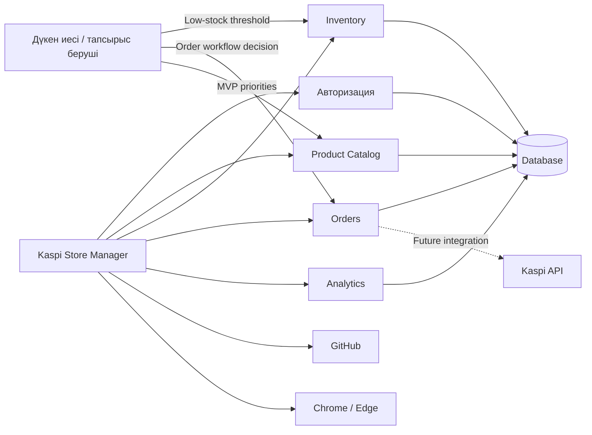

# ЛЗ 5 — Тәуелділіктер картасы

## Сыртқы тәуелділіктер

| ID | Тәуелділік / шешім | Түрі | Иесі | Растау/шешім күні | Күйі |
|---|---|---|---|---|---|
| DEP-01 | GitHub репозиторийі және Issues қолжетімділігі | Сыртқы сервис | Developer | 06.10.2026 | Confirmed |
| DEP-02 | Kaspi API қолжетімділігі және интеграция шарты | Сыртқы интеграция | Project Manager / Kaspi | 23.10.2026 | Pending |
| DEP-03 | PostgreSQL / DB hosting ортасының қолжетімділігі | Сыртқы инфрақұрылым | Developer / hosting provider | 16.10.2026 | Pending |
| DEP-04 | Low-stock threshold мәнін бекіту | Тапсырыс беруші шешімі | Store Owner | 30.10.2026 | Pending |
| DEP-05 | Order Status workflow келісімі | Тапсырыс беруші шешімі | Store Owner | 06.11.2026 | Pending |

Критерийдегі кемінде 3 сыртқы тәуелділік талабы DEP-01, DEP-02 және DEP-03 арқылы орындалады; әрқайсысында иесі және растау/шешім күні көрсетілген.
